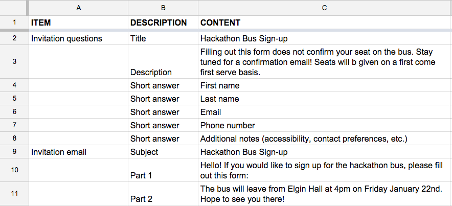
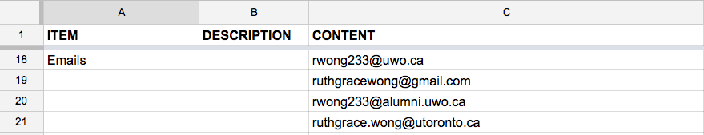
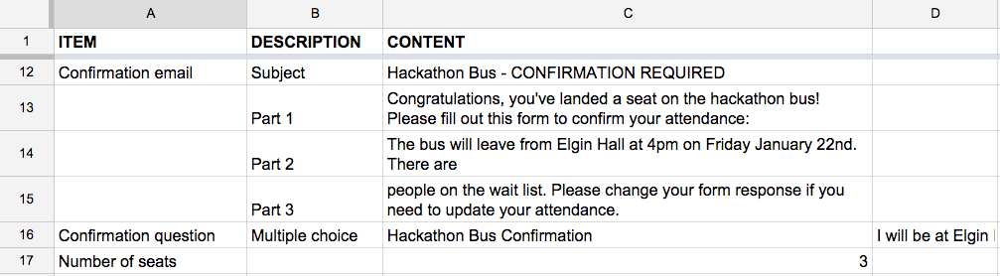

# RSVPlease

Google apps script for automating RSVP invitation, confirmation, wait list movement process.

## Use

See the [RSVPlease template](https://docs.google.com/spreadsheets/d/1nL1eo3AuFfll7rHmkzXOrT9csvKNDNDfpBYszhxhqlY/edit?usp=sharing)

### Sending invitations

The first step is to send your invitations. Make sure that your invitation email and invitation form title, description, and questions are filled out, along with the email list in the Google Sheet.

#### Invitation data

#### Email list

### Asking for confirmations

The second step is to take the list of sign-ups and ask as many as fit into your event to confirm their attendance. Make sure your confirmation email and confirmation form question are filled out in the Google Sheet. This will be added onto the end of the invitation form. You also need to fill in the Number of seats in the Google Sheet.

### Moving the wait list

The last step is to periodically move the wait list by assuming that the people who haven't confirmed are not coming. If there are seats remaining, the people who signed up who didn't get seats will be sent confirmations.

